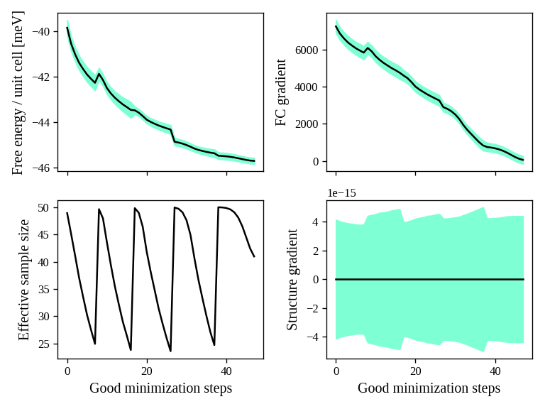
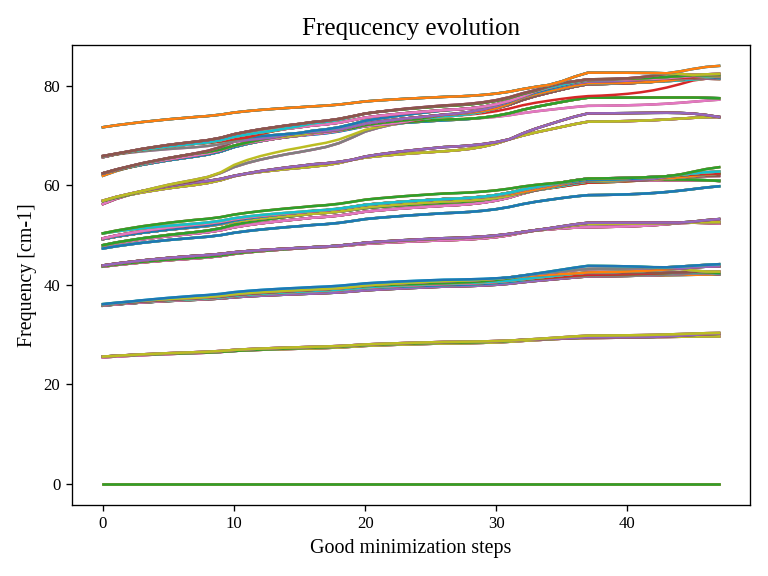
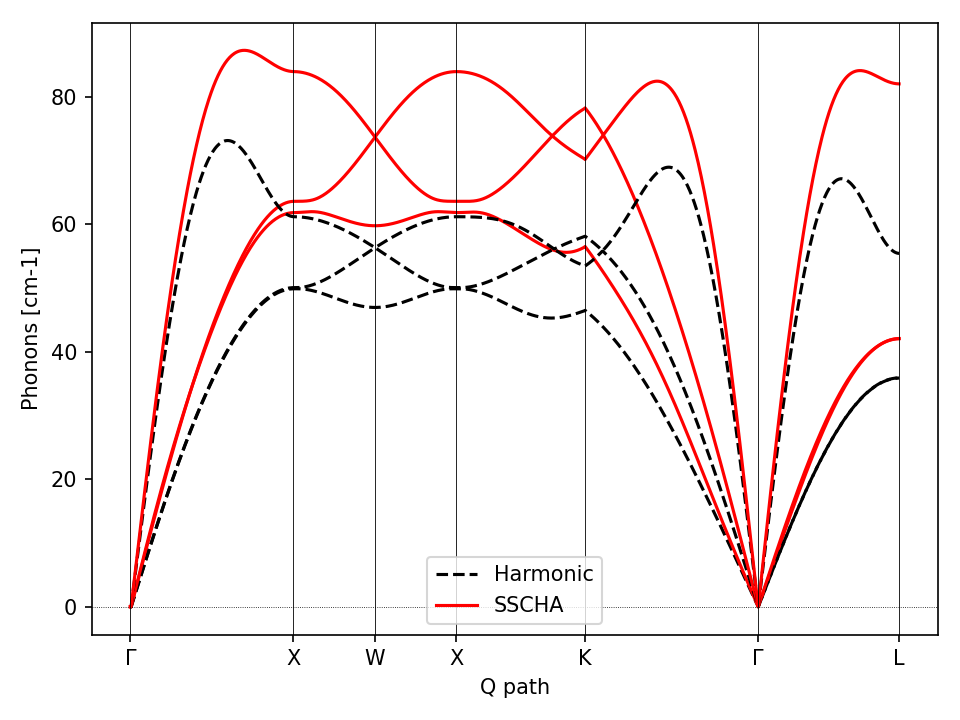
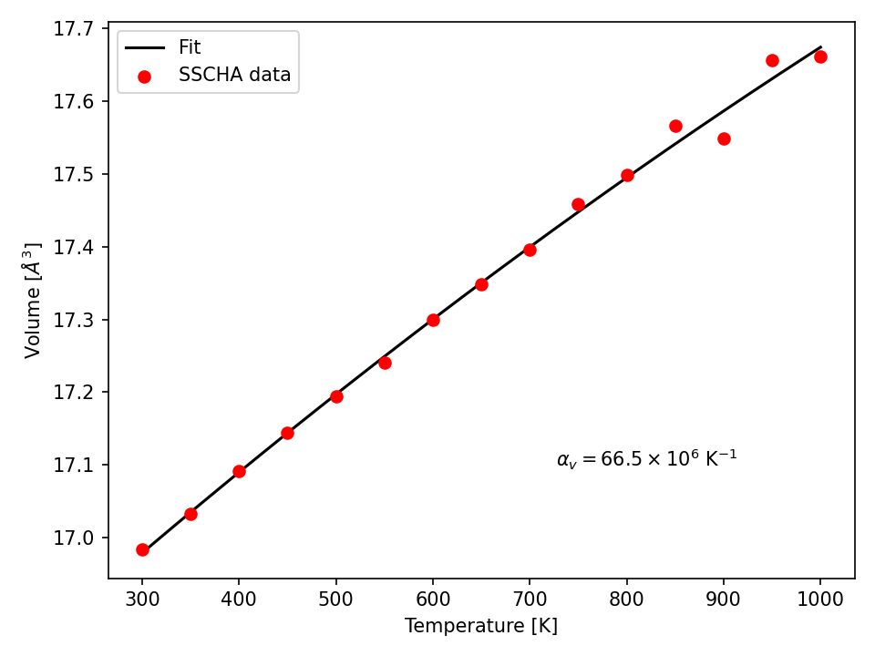

Quick start
===========

In this chapter we provide ready to use examples to setup your first SSCHA calculation.

The free energy of gold: a simulation in the NVT ensemble
---------------------------------------------------------

This simple tutorial explains how to setup a SSCHA calculation starting just from the structure, in this case a cif file we downloaded from the [Materials Project](https://materialsproject.org/materials/mp-81/) database.

You can find there a lot of structures ready to use for your SSCHA runs.

For the purpouse of this tutorial, we are going to use the EMT force field, so that the calculation can be run in a laptop without the need of a supercomputer.
We explain in a later section how to couple the SSCHA with a cluster to submit the same calculation fully ab-initio.

Starting from the Gold structure in the primitive cell, to run the SSCHA we need:
 - Compute the harmonic phonons (dynamical matrix)
 - Remove imaginary frequencies (if any)
 - Run the SSCHA

We prepared an input file in the form of a python script (tested with python-sscha version 1.2) which makes all these passages automatically.

You find a copy of the script and the cif file of Gold inside the directory Examples/ThermodynamicsOfGold

.. code-block:: python

   # Import the sscha code
   import sscha, sscha.Ensemble, sscha.SchaMinimizer, sscha.Relax, sscha.Utilities

   # Import the cellconstructor library to manage phonons
   import cellconstructor as CC, cellconstructor.Phonons
   import cellconstructor.Structure, cellconstructor.calculators

   # Import the force field of Gold
   import ase, ase.calculators
   from ase.calculators.emt import EMT

   # Import numerical and general pourpouse libraries
   import numpy as np, matplotlib.pyplot as plt
   import sys, os

   """
   Here we load the primitive cell of Gold from a cif file.
   And we use CellConstructor to compute phonons from finite differences.
   The phonons are computed on a q-mesh 4x4x4
   """

   gold_structure = CC.Structure.Structure()
   gold_structure.read_generic_file("Au.cif")

   # Get the force field for gold
   calculator = EMT()

   # Relax the gold structure (useless since for symmetries it is already relaxed)
   relax = CC.calculators.Relax(gold_structure, calculator)
   gold_structure_relaxed = relax.static_relax()

   # Compute the harmonic phonons
   # NOTE: if the code is run with mpirun, the calculation goes in parallel
   gold_harmonic_dyn = CC.Phonons.compute_phonons_finite_displacements(gold_structure_relaxed, calculator, supercell = (4,4,4))

   # Impose the symmetries and 
   # save the dynamical matrix in the quantum espresso format
   gold_harmonic_dyn.Symmetrize()
   gold_harmonic_dyn.save_qe("harmonic_dyn")

   # If the dynamical matrix has imaginary frequencies, remove them
   gold_harmonic_dyn.ForcePositiveDefinite()

   """
   gold_harmonic_dyn is ready to start the SSCHA calculation.

   Now let us initialize the ensemble, and the calculation at 300 K.
   We will run a NVT calculation, using 100 configurations at each step
   """

   TEMPERATURE = 300
   N_CONFIGS = 50
   MAX_ITERATIONS = 20

   # Initialize the random ionic ensemble
   ensemble = sscha.Ensemble.Ensemble(gold_harmonic_dyn, TEMPERATURE)

   # Initialize the free energy minimizer
   minim = sscha.SchaMinimizer.SSCHA_Minimizer(ensemble)
   minim.set_minimization_step(0.01) 

   # Initialize the NVT simulation
   relax = sscha.Relax.SSCHA(minim, calculator, N_configs = N_CONFIGS,
   max_pop = MAX_ITERATIONS)

   # Define the I/O operations
   # To save info about the free energy minimization after each step
   ioinfo = sscha.Utilities.IOInfo()
   ioinfo.SetupSaving("minim_info")
   relax.setup_custom_functions(custom_function_post = ioinfo.CFP_SaveAll)

   # Run the NVT simulation (save the stress to compute the pressure)
   relax.relax(get_stress = True)

   # If instead you want to run a NPT simulation, use
   # The target pressure is given in GPa.
   #relax.vc_relax(target_press = 0)

   # You can also run a mixed simulation (NVT) but with variable lattice parameters
   #relax.vc_relax(fix_volume = True)

   # Now we can save the final dynamical matrix
   # And print in stdout the info about the minimization
   relax.minim.finalize()
   relax.minim.dyn.save_qe("sscha_T{}_dyn".format(TEMPERATURE))

Now save the file as `sscha_gold.py` and execute it with:

.. code-block:: bash

   $ python sscha_gold.py > output.log

And that's it. The code will probably take few minutes on a standard laptop computer.
**Congratulations!** You run your first SSCHA simulation!

If you open a new terminal in the same directory of the SSCHA submission, you can plot the info during the minimization.
Starting from version 1.2, we provide a visualization utilities installed together with the SSCHA.
Simply type

.. code-block:: bash

   $ sscha-plot-data.py minim_info

You will see two windows.

.. _fig-goldminim:

   Minimization data of Gold.
   
In :numref:`fig-goldminim` we have all the minimization data. On the top-left panel, we see the free energy. As expected, it decreases (since the SSCHA is minimizing it).
You can see that at certain values of the steps there are discontinuities.
These occurs when the code realizes that the ensemble on which it is computing is no more good and a new one is generated. The goodness of an ensemble is determined by the Kong-Liu effective sample size (bottom-left).
When it reaches 0.5 of its initial value (equal to the number of configurations), the ensemble is extracted again and a new iteration starts. You see that in the last iteration, the code stops before getting to 25 (:math:`0.5\cdot 50`). This means that the code converged properly: the gradient reached zero when the ensemble was still good.

On the right-side you see the free energy gradients, which must go to zero to converge. The top-right is the gradient of the SSCHA dynamical matrix, while on bottom-right there is the gradient of the average atomic positions.

Indeed, since the gold atomic positions are all fixed by symmetries, it is always zero (but it will be different from zero in more complex system).

.. _fig-goldfreqs:

   All the SSCHA phonon frequencies as a function of the step in the NVT simulation.

Instead, :numref:`fig-goldfreqs` represents the evolution of the SSCHA phonon frequencies.
Here, all the frequencies in the supercell (at each q point commensurate with the calculation) are shown.

By looking at how they change you can have an idea on which phonon mode are more affected by anharmonicity. In this case, it is evident that Gold is trongly anharmonci and that the finite temperature tend to harden almost all the phonon frequencies.

At the end of the simulation, the code writes the final dynamical matrix in the quantum espresso file format: *sscha_T300_dynX* where X goes over the number of irreducible q points.

In the next section, we analyze in details each section of the script to provide a bit more insight on the simulation, and a guide to modify it to fit your needs and submit your own system.

Plot the phonon dispersion
--------------------------

Now that the SSCHA minimization ended, we can compare the harmonic and anharmonic phonon dispersion of Gold.

To this purpouse, we can simply run a script like the following. You find a copy of this script already in Examples/ThermodynamicsOfGold/plot_dispersion.py.

You can use it even in your simulation, simply edit the value of the uppercase keyword at the beginning of the script to match your needs.

.. code-block:: python

   # Import the CellConstructor library to plot the dispersion
   import cellconstructor as CC, cellconstructor.Phonons
   import cellconstructor.ForceTensor

   # Import the numerical libraries and those for plotting
   import numpy as np
   import matplotlib.pyplot as plt

   import sys, os

   # Let us define the PATH in the brilluin zone and the total number of points
   PATH = "GXWXKGL"
   N_POINTS = 1000

   # Here we define the position of the special points
   SPECIAL_POINTS = {"G": [0,0,0],
		"X": [0, .5, .5],
		"L": [.5, .5, .5],
		"W": [.25, .75, .5],
		"K": [3/8., 3/4., 3/8.]}

   # The two dynamical matrix to be compared
   HARM_DYN = 'harmonic_dyn'
   SSCHA_DYN = 'sscha_T300_dyn'

   # The number of irreducible q points
   # i.e., the number of files in which the phonons are stored
   NQIRR = 13

   # --------------------- THE SCRIPT FOLLOWS ---------------------
   
   # Load the harmonic and sscha phonons
   harmonic_dyn = CC.Phonons.Phonons(, NQIRR)
   sscha_dyn = CC.Phonons.Phonons('sscha_T300_dyn', NQIRR)

   # Get the band path
   qpath, data = CC.Methods.get_bandpath(harmonic_dyn.structure.unit_cell,
		PATH,
		SPECIAL_POINTS,
		N_POINTS)
   xaxis, xticks, xlabels = data # Info to plot correclty the x axis

   # Get the phonon dispersion along the path
   harmonic_dispersion = CC.ForceTensor.get_phonons_in_qpath(harmonic_dyn, qpath)
   sscha_dispersion = CC.ForceTensor.get_phonons_in_qpath(sscha_dyn, qpath)

   nmodes = harmonic_dyn.structure.N_atoms * 3

   # Plot the two dispersions
   plt.figure(dpi = 150)
   ax = plt.gca()

   for i in range(nmodes):
       lbl=None
       lblsscha = None
       if i == 0:
           lbl = 'Harmonic'
	   lblsscha = 'SSCHA'

       ax.plot(xaxis, harmonic_dispersion[:,i], color = 'k', ls = 'dashed', label = lbl)
       ax.plot(xaxis, sscha_dispersion[:,i], color = 'r', label = lblsscha)

   # Plot vertical lines for each high symmetry points
   for x in xticks:
   ax.axvline(x, 0, 1, color = "k", lw = 0.4)
   ax.axhline(0, 0, 1, color = 'k', ls = ':', lw = 0.4)
   
   # Set the x labels to the high symmetry points
   ax.set_xticks(xticks)
   ax.set_xticklabels(xlabels)

   ax.set_xlabel("Q path")
   ax.set_ylabel("Phonons [cm-1]")

   plt.tight_layout()
   plt.savefig("dispersion.png")
   plt.show()

If we save the script as `plot_dispersion.py` in the same directory of the calculation, we can run it with

.. code-block:: bash

   $ python plot_dispersion.py

.. _fig-dispersion:

   Comparison between the SSCHA and the harmonic phonon dispersion of Gold.

The script will plot the figure of the phonon dispersion :numref:`fig-dispersion`.
It is quite different from the experimental one because of the poor accuracy of the force field, however, the SSCHA results is much closer to the experimental value.

Analysis of the input script for the NVT simulation
---------------------------------------------------

While the input may seem long, it is heavily commented, but lets go through it step by step.
At the very beginning, we simply import the sscha libraries, cellconstructor, the math libraries and the force field. This is done in python with the `import` statemets. 

The first real part of the code is:

.. code-block:: python
   
   gold_structure = CC.Structure.Structure()
   gold_structure.read_generic_file("Au.cif")

   # Get the force field for gold
   calculator = EMT()

   # Relax the gold structure (useless since for symmetries it is already relaxed)
   relax = CC.calculators.Relax(gold_structure, calculator)
   gold_structure_relaxed = relax.static_relax()

Here we initialize a cellconstructor structure from the cif file downloaded from the material database (*Au.cif*). We initialize the EMT calculator from ASE, and relax the structure.

In the case of Gold the relaxation is useless, as it is a FCC structure with Fm-3m symmetry group and 1 atom per primitive cell. This means the atomic positions have no degrees of freedom, thus the relaxation will end before even start.

In the next part of the code, we perform the harmonic phonon calculation using cellconstructor and a finite displacement approach:

.. code-block:: python

   gold_harmonic_dyn = CC.Phonons.compute_phonons_finite_displacements(gold_structure_relaxed, calculator, supercell = (4,4,4))

   # Impose the symmetries and 
   # save the dynamical matrix in the quantum espresso format
   gold_harmonic_dyn.Symmetrize()
   gold_harmonic_dyn.save_qe("harmonic_dyn")

   # If the dynamical matrix has imaginary frequencies, remove them
   gold_harmonic_dyn.ForcePositiveDefinite()

The method `compute_phonons_finite_displacements` is documented in the CellConstructor guide. It requires the structure (in this case `gold_structure_relaxed`), the force-field (`calculator`) and the supercell for the calculation. In this case we use a 4x4x4 (equivalent to 64 atoms). This may not be sufficient to converge all the properties, especially at very high temperature, but it is just a start.

Note that  `compute_phonons_finite_displacements`  works in parallel with MPI, therefore, if the script is executed with `mpirun -np 16 python myscript.py` it will split the calculations of the finite displacements across 16 processors. You need to have mpi4py installed.

After computing the harmonic phonons in gold_harmonic_dyn, we impose the correct symmetrization and the acousitic sum rule with the `Symmetrize` method, and save the result in the quantum ESPRESSO format with `save_qe`.
This should not be the case for Gold, however, if we have a structure which has imaginary phonon frequencies, we need to get rid of them before starting the SSCHA. This is achieved with `ForcePositiveDefinite` (see CellConstructor documentation for more details on how these methods work).

**Now we are ready to submit the SSCHA calculation in the NVT ensemble!**.
The important parameters are:
  - The temperature
  - The number of random configurations in the ensemble
  - The maximum number of iterations

These parameters are almost self-explaining. However, we give a brief overview of how the SSCHA works to help you understand which are the best one for your case.
While MD or MC calculation represent the equilibrium probability distribution over time of the system by updating a single structure, the SSCHA encodes the whole probability distribution as an analytical function. Therefore, to compute properties, we can generate on the fly the ionic configurations that represent the equilibrium distributions.
The number of random configuration is exactly how many ionic configuration we generate to compute the properties (Free energy and Stress tensors)

The code that sets up and perform the SSCHA is the following:

.. code-block:: python

   TEMPERATURE = 300
   N_CONFIGS = 50
   MAX_ITERATIONS = 20

   # Initialize the random ionic ensemble
   ensemble = sscha.Ensemble.Ensemble(gold_harmonic_dyn, TEMPERATURE)

   # Initialize the free energy minimizer
   minim = sscha.SchaMinimizer.SSCHA_Minimizer(ensemble)
   minim.set_minimization_step(0.01) 

   # Initialize the NVT simulation
   relax = sscha.Relax.SSCHA(minim, calculator, N_configs = N_CONFIGS,
   max_pop = MAX_ITERATIONS)

   # Define the I/O operations
   # To save info about the free energy minimization after each step
   ioinfo = sscha.Utilities.IOInfo()
   ioinfo.SetupSaving("minim_info")
   relax.setup_custom_functions(custom_function_post = ioinfo.CFP_SaveAll)

   # Run the NVT simulation
   relax.relax(get_stress = True)
   

So you see many classes. `ensemble` represent the ensemble of ionic configurations. We initialize it with the dynamical matrix (which represent how much atoms fluctuate around the centroids) and the temperature.
`minim` is a `SSCHA_Minimizer` object, which performs the free energy minimization. It contains all the info regarding the minimization algorithm, as the initial timestep (that here we set to 0.01). You can avoid setting the time-step, as the code will automatically guess the best value.
The `relax` is a `SSCHA` object: the class that takes care about the simulation and automatizes all the steps to perform a NVT or NPT calculation.
We pass the minimizer (which contains the ensemble with the temperature), the force-field (`calculator`), the number of configurations `N_configs` and the maximum number of iterations.

In this example, most of the time is spent in the minimization, however, if we replace the force-field with ab-initio DFT, the time tu run the minimization is negligible with respect to the time to compute energies and forces on the ensemble configurations.
The total (maximum) number of energy/forces calculations is equal to the number of configurations times the number of iterations (passed through the `max_pop` argument).

The calculation is submitted with `relax.relax()`. However, before running the calculation we introduce another object, the `IOInfo`.
This tells the `relax` to save information of the free energy, its gradient and the anharmonic phonon frequencies during the minimization in the files *minim_info.dat° and *minim_info.freqs*. It is not mandatory to introduce them, but it is very usefull as it allows to visualize the minimization while it is running.

Exercise
--------

Try to perform the simulation of Gold but at a different temperature, plot then the SSCHA phonon dispersion as a function of temperature.

How does the phonon bands behaves with temperature? Do they become more rigid (energy increases) or softer?

Running in the NPT ensemble: simulating thermal expansion
---------------------------------------------------------

Now that you have some experience with the NVT simulation we are ready for the next step: NPT,
or relaxing the lattice.

With python-sscha it is very easy to run NPT simulation, you simply have to replace the line of the NVT script with the target pressure for the simulation:

.. code-block:: python

   # Replace the line
   # relax.relax(get_stress = True)
   # with
   relax.vc_relax(target_press = 0)

And that is all! The target pressure is expressed in GPa, in this case 0 is ambient conditions (1 atm = 0.0001 GPa)

You can also perform NVT simulation with variable lattice parameters: In this case the system will constrain the total volume to remain constant, but the lattice parameter will be optimized (if the system is not cubic and has some degrees of freedom, which is not the case for Gold).

The NVT ensemble with variable lattice parameters (cell shape) is

.. code-block:: python

   # Replace the line
   #    relax.vc_relax(target_press = 0)
   # with
   relax.vc_relax(fix_volume = True)

Indeed, this is a NVT simulation, therefore there is no need to specify the target pressure.

The following script, we run the NPT ensemble at various temperatures, each time starting from the previous ensemble, to follow the volume thermal expansion of gold.

You can find the full script in Examples/ThermodynamicsOfGold/thermal_expansion.py

This script assume you already performed the NVT calculation, so that we can start from that results, and avoid the harmonic calculation (It is always a good practice to start with NVT simulation and then run NPT from the final result).

.. code-block:: python

   # Import the sscha code
   import sscha, sscha.Ensemble, sscha.SchaMinimizer, sscha.Relax
   import sscha.Utilities

   # Import the cellconstructor library to manage phonons
   import cellconstructor as CC, cellconstructor.Phonons
   import cellconstructor.Structure, cellconstructor.calculators

   # Import the force field of Gold
   import ase, ase.calculators
   from ase.calculators.emt import EMT

   # Import numerical and general pourpouse libraries
   import numpy as np, matplotlib.pyplot as plt
   import sys, os

   # Define the temperature range (in K)
   T_START = 300
   T_END = 1000
   DT = 50

   N_CONFIGS = 50
   MAX_ITERATIONS = 10

   # Import the gold force field
   calculator = EMT()

   # Import the starting dynamical matrix (final result of get_gold_free_energy.py)
   dyn = CC.Phonons.Phonons("sscha_T300_dyn", nqirr = 13)

   # Create the directory on which to store the output
   DIRECTORY = "thermal_expansion"
   if not os.path.exists(DIRECTORY):
       os.makedirs("thermal_expansion")

   # We cycle over several temperatures
   t = T_START

   volumes = []
   temperatures = []
   while t <= T_END:
       # Change the temperature
       ensemble = sscha.Ensemble.Ensemble(dyn, t)
       minim = sscha.SchaMinimizer.SSCHA_Minimizer(ensemble)
       minim.set_minimization_step(0.1)

       relax = sscha.Relax.SSCHA(minim, calculator, N_configs = N_CONFIGS,
                                 max_pop = MAX_ITERATIONS)

       # Setup the I/O
       ioinfo = sscha.Utilities.IOInfo()
       ioinfo.SetupSaving( os.path.join(DIRECTORY, "minim_t{}".format(t)))
       relax.setup_custom_functions( custom_function_post = ioinfo.CFP_SaveAll)

       # Run the NPT simulation
       relax.vc_relax(target_press = 0)

       # Save the volume and temperature
       volumes.append(relax.minim.dyn.structure.get_volume())
       temperatures.append(t)

       # Start the next simulation from the converged value at this temperature
       relax.minim.dyn.save_qe( os.path.join(DIRECTORY, "sscha_T{}_dyn".format(t)))
       dyn = relax.minim.dyn

       # Print in standard output 
       relax.minim.finalize()

       # Update the temperature
       t += DT

       # Save the thermal expansion
       np.savetxt(os.path.join(DIRECTORY, "thermal_expansion.dat"),
                  np.transpose([temperatures, volumes]),
	          header = "Temperature [K]; Volume [A^3]")

    
You can run the script as always with:

.. code-block:: bash

   $ python thermal_expansion.py

And ... done!

This calculation is going to require a bit more time, as we run multiple SSCHA at several temperatures.
After it finishes, you can plot the results written in the file thermal_expansion/thermal_expansion.dat.

A simple script to plot the thermal expansion (and fit the volumetric thermal expansion value) is the following

.. code-block:: python

   
   import numpy as np
   import matplotlib.pyplot as plt

   import scipy, scipy.optimize

   # Load all the dynamical matrices and compute volume
   DIRECTORY = "thermal_expansion"
   FILE = os.path.join(DIRECTORY, "thermal_expansion.dat")

   # Load the data from the final data file
   temperatures, volumes = np.loadtxt(FILE, unpack = True)

   # Prepare the figure and plot the V(T) from the sscha data
   plt.figure(dpi = 150)
   plt.scatter(temperatures, volumes, label = "SSCHA data")

   # Fit the data to estimate the volumetric thermal expansion coefficient
   def parabola(x, a, b, c):
       return a + b*x + c*x**2
   def diff_parab(x, a, b, c):
       return b + 2*c*x

   popt, pcov = scipy.optimize.curve_fit(parabola, temperatures, volumes,
					 p0 = [0,0,0])

   # Evaluate the volume thermal expansion
   vol_thermal_expansion = diff_parab(300, *popt) / parabola(300, *popt)
   plt.text(0.6, 0.2, r"$\alpha_v = "+"{:.1f}".format(vol_thermal_expansion*1e6)+r"\times 10^6 $ K$^{-1}$",
	    transform = plt.gca().transAxes)

   # Plot the fit
   _t_ = np.linspace(np.min(temperatures), np.max(temperatures), 1000)
   plt.plot(_t_, parabola(_t_, *popt), label = "Fit")

   # Adjust the plot adding labels, legend, and saving in eps
   plt.xlabel("Temperature [K]")
   plt.ylabel(r"Volume [$\AA^3$]")
   plt.legend()
   plt.tight_layout()
   plt.savefig("thermal_expansion.png")
   plt.show()

.. _fig-goldexpansion:

   Thermal expansion of Gold. From the fit of the data we can compute the volumetric
   thermal expansion coefficient (at 300 K).

We report the final thermal expansion in :numref:`fig-goldexpansion`.
The volumetric expansion coefficient :math:`\alpha_v` is obtained from the fit
thanks to the thermodynamic relation:

.. math::

   \alpha_v = \frac{1}{V} \left(\frac{dV}{dT}\right)_P

Also in this case, the result is quite off with experiments, due to the not completely realistic force-field employed. To get a more realistic approach, you should use *ab-initio* calculations or a more refined force-field.

Ab initio calculation with the SSCHA code
-----------------------------------------

The SSCHA code is compatible with the Atomic Simulation Environment (ASE), which we employed in the previous tutorial to get a fast force-field for Gold.

However, ASE already provides an interface with most codes to run ab initio simulations.
The simplest way of interfacing the SSCHA to an other ab initio code is to directly use ASE.

The only difference is in the definition of the calculator, in the first example of this chapter, the Gold force field was defined as:

.. code-block:: python

   import ase
   from ase.calculators.emt import EMT
   calculator = EMT()

We simply need to replace these lines to our favourite DFT code. In this example we are going to use quantum espresso, but the procedure for VASP, CASTEP, CRYSTAL, ABINIT, SIESTA, or your favourite one are exatly the same (Refer to the official documentatio of ASE to the instruction on how to initialize these calculators).

In the case of DFT, unfortunately, we cannot simply create the calculator in one line, like we did for EMT force-field, as we need also to provide a lot of parameters, as pseudopotentials, the choice of exchange correlation, the cutoff of the basis set, and the k mesh grid for Brilluin zone sampling.

In the following example, we initialize the quantum espresso calculator for Gold.

.. code-block:: python

   import cellconstructor.Calculators
   
   # Initialize the DFT (Quantum Espresso) calculator for gold
   # The input data is a dictionary that encodes the pw.x input file namelist
   input_data = {
       'control' : {
	   # Avoid writing wavefunctions on the disk
	   'disk_io' : 'None',
	   # Where to find the pseudopotential
	   'pseudo_dir' : '.'
       },
       'system' : {
	   # Specify the basis set cutoffs
	   'ecutwfc' : 45,   # Cutoff for wavefunction
	   'ecutrho' : 45*4, # Cutoff for the density
	   # Information about smearing (it is a metal)
	   'occupations' : 'smearing',
	   'smearing' : 'mv',
	   'degauss' : 0.03
       },
       'electrons' : {
           'conv_thr' : 1e-8
       }
   }

   # the pseudopotential for each chemical element
   # In this case just Gold
   pseudopotentials = {'Au' : 'Au_ONCV_PBE-1.0.oncvpsp.upf'}

   # the kpoints mesh and the offset
   kpts = (1,1,1)
   koffset = (1,1,1)

   # Prepare the quantum espresso calculator
   calculator = CC.calculators.Espresso(input_data,
					pseudopotentials,
					kpts = kpts,
					koffset = koffset)

If you are familiar with the quantum espresso input files, you should recognize all the options inside the input_data dictionary. For more options and more information, refer to the `quantum ESPRESSO pw.x input guide <https://www.quantum-espresso.org/Doc/INPUT_PW.html>`_.

Remember, the parameters setted here are just for fun, remember to run appropriate convergence check of the kmesh, smearing and basis set cutoffs before running the SSCHA code.
Keep also in mind that this input file refers to the supercell, and the kpts variable can be properly rescaled if the supercell is increased.

All the rest of the code remains the same (but here we do not compute harmonic phonons, which can be done more efficiently within the Quantum ESPRESSO).
Instead, we take the result obtained with EMT in the previous sections, and try to relax the free energy with a fully ab-initio approach.

The complete code is inside Examples/sscha_and_dft/nvt_local.py

.. code-block:: python

   # Import the sscha code
   import sscha, sscha.Ensemble, sscha.SchaMinimizer, sscha.Relax, sscha.Utilities

   # Import the cellconstructor library to manage phonons
   import cellconstructor as CC, cellconstructor.Phonons
   import cellconstructor.Structure, cellconstructor.calculators

   # Import the DFT calculator
   import cellconstructor.calculators

   # Import numerical and general pourpouse libraries
   import numpy as np, matplotlib.pyplot as plt
   import sys, os

   # Initialize the DFT (Quantum Espresso) calculator for gold
   # The input data is a dictionary that encodes the pw.x input file namelist
   input_data = {
       'control' : {
	   # Avoid writing wavefunctions on the disk
	   'disk_io' : 'None',
	   # Where to find the pseudopotential
	   'pseudo_dir' : '.'
       },
       'system' : {
	   # Specify the basis set cutoffs
	   'ecutwfc' : 45,   # Cutoff for wavefunction
	   'ecutrho' : 45*4, # Cutoff for the density
	   # Information about smearing (it is a metal)
	   'occupations' : 'smearing',
	   'smearing' : 'mv',
	   'degauss' : 0.03
       },
       'electrons' : {
	   'conv_thr' : 1e-8
       }
   }

   # the pseudopotential for each chemical element
   # In this case just Gold
   pseudopotentials = {'Au' : 'Au_ONCV_PBE-1.0.oncvpsp.upf'}

   # the kpoints mesh and the offset
   kpts = (1,1,1)
   koffset = (1,1,1)

   # Specify the command to call quantum espresso
   command = 'pw.x -i PREFIX.pwi > PREFIX.pwo'

   # Prepare the quantum espresso calculator
   calculator = CC.calculators.Espresso(input_data,
					pseudopotentials,
					command = command,
					kpts = kpts,
					koffset = koffset)

   TEMPERATURE = 300
   N_CONFIGS = 50
   MAX_ITERATIONS = 20
   START_DYN = 'start_dyn'
   NQIRR = 13

   # Let us load the starting dynamical matrix
   gold_dyn = CC.Phonons.Phonons(START_DYN, NQIRR)

   # Initialize the random ionic ensemble
   ensemble = sscha.Ensemble.Ensemble(gold_dyn, TEMPERATURE)

   # Initialize the free energy minimizer
   minim = sscha.SchaMinimizer.SSCHA_Minimizer(ensemble)
   minim.set_minimization_step(0.01) 

   # Initialize the NVT simulation
   relax = sscha.Relax.SSCHA(minim, calculator, N_configs = N_CONFIGS,
			     max_pop = MAX_ITERATIONS)

   # Define the I/O operations
   # To save info about the free energy minimization after each step
   ioinfo = sscha.Utilities.IOInfo()
   ioinfo.SetupSaving("minim_info")
   relax.setup_custom_functions(custom_function_post = ioinfo.CFP_SaveAll)

   # Run the NVT simulation (save the stress to compute the pressure)
   relax.relax(get_stress = True)

   # If instead you want to run a NPT simulation, use
   # The target pressure is given in GPa.
   #relax.vc_relax(target_press = 0)

   # You can also run a mixed simulation (NVT) but with variable lattice parameters
   #relax.vc_relax(fix_volume = True)

   # Now we can save the final dynamical matrix
   # And print in stdout the info about the minimization
   relax.minim.finalize()
   relax.minim.dyn.save_qe("sscha_T{}_dyn".format(TEMPERATURE))

Now you can run the SSCHA with an ab-initio code!
However, your calculation will probably take forever.
To speedup things, lets discuss parallelization and how to exploit modern HPC infrastructures.

Parallelization
---------------

If you actually tried to run the code of the previous section on a laptop, it will take forever.
The reason is that DFT calculations are much more expensive than the SSCHA minimization. While SSCHA minimizes the number of ab initio calculations (especially when compared with MD or PIMD), still they are the bottleneck of the computational time.

For this reason, we need an opportune parallelization strategy to reduce the total time to run a SSCHA.

The simplest way is to call the previous python script with MPI:

.. code-block:: bash

   $ mpirun -np 50 python nvt_local.py > output.log

The code will split the configurations in each ensemble on a different MPI process. In this case we have 50 configurations per ensemble, by splitting them into 50 processors, we run the full ensemble in parallel.

However, still the single DFT calculation on 1 processor is going to take hours, and in some cases it may even take days.
Luckily, also quantum ESPRESSO (and many other software) have an internal parallelization to work with.
For example, we can tell quantum espresso to run itself in parallel on 8 processors.
To this purpouse, we simply need to modify the command used to run quantum espresso in the previous script.

.. code-block:: python

   # Lets replace
   # command = 'pw.x -i PREFIX.pwi > PREFIX.pwo'
   # with
   command = 'mpirun -np 8 pw.x -npool 1 -i PREFIX.pwi > PREFIX.pwo'

   # The command string is passed to the espresso calculator
   calculator = CC.calculators.Espresso(input_data,
					pseudopotentials,
					command = command,
					kpts = kpts,
					koffset = koffset)

In this way, our calculations will run on 400 processors (50 processors splits the ensemble times 8 processors per each calculation).
This is achieved by nesting mpi calls. However, only the cellconstructor calculators can nest mpi calls without raising errors. This is the reason why we imported the Espresso class from cellconstructor and not from ASE.
If you want to use ASE for your calculator, you can only use the inner parallelization of the calculator modifying the command, as ASE itself implements a MPI parallelization on I/O operations that conflicts with the python-sscha parallelization. This limitation only applies to FileIOCalculators from ASE (thus the EMT force-field is not affected and can be safely employed with python-sscha parallelization).

With this setup, the full code is parallelized over 400 processors. However the SSCHA minimization algorithm is a serial one, and all the time spent in the actual SSCHA minimization is wasting the great number of resources allocated.
Moreover, the SSCHA code needs to be configured and correctly installed on the cluster, which may be a difficult operation due to the hybrid Fortran/pyhton structure.

In the next section, we provide a workaround: Running the SSCHA code on your laptop, and configure it to automatically interact with a remote server (HPC) in which the ensemble calculation is submitted.
This is the best way to use the python-sscha code, as no installation of the code in the cluster is required, and the time spent during the minimization does not occupy precious HPC resources.

Remote submission on a queue system
-----------------------------------

To configure SSCHA to work with a cluster we need to tell the code some info to ssh into it.
Here is a basic configuration to connect to the Piz Daint cluster at CSCS (Switzerland), but it is very similar to any other cluster.

First of all, we need to configure a straight ssh connection. We have to add to the configuration file of ssh the information about Host and Username. In my case, the $HOME/.ssh/config file looks like:

.. code-block:: bash

   Host ela
	HostName ela.cscs.ch
	User lmonacel
   Host daint
	HostName daint.cscs.ch
	ProxyJump ela
	User lmonacel

These are two connection, one to ela (the front-end server of CSCS) and then one to daint.
To connect to daint, I must before access to ela, this is the reason of ProxyJump command inside the daint block.
The best way to connect is to configure your ssh private-public key so that you (and python-sscha) can login without password.
An example of how to do that is `Here <http://www.linuxproblem.org/art_9.html>`_, but you may find a lot of other on internet.

Sometimes cluster may not allow passwordless connection, in this case, you need to provide the password explicitly to python-sscha.

.. code-block:: python

   # Let us define the cluster
   import sscha.Cluster
   cluster = sscha.Cluster.Cluster(hosthame = 'daint', pwd = None)  # Put the password in pwd if needed

   # Configure the submission strategy
   cluster.account_name = 's1073'  # Name of the account on which to subtract nodes
   cluster.n_nodes = 1             # Number of nodes requested for each job
   cluster.time = '02:30:00'       # Total time requested for each job
   cluster.n_pool = 1              # Number of pools for the Quantum ESPRESSO calculation

   # Here some custom parameters for the clusters
   # These are specific for daint, but you can easily figure out those for your machine
   cluster.custom_params["--constraint"] = "gpu"      # Run on the GPU partition
   cluster.custom_params["--ntasks-per-node"] = '2'
   cluster.custom_params["--cpus-per-task"] = '6'

   # Since daint specify the partition with a custom option,
   # Lets remove the specific partition option of SLURM
   # Neither we want to specify the total number of cpus (automatically determined by the node)
   cluster.use_partition = False
   cluster.use_cpu = False

   # Now, we need to tell daint which modules to load to run quantum espresso
   # Also this is cluster specific, but very simple to figure it out for you
   cluster.load_modules = """
   # Load the quantum espresso modules
   module load daint-gpu
   module load QuantumESPRESSO

   # Configure the environmental variables of the job
   export OMP_NUM_THREADS=${SLURM_CPUS_PER_TASK}
   export NO_STOP_MESSAGE=1
   export CRAY_CUDA_MPS=1
   
   ulimit -s unlimited
   """

   # Now, what is the command to run quantum espresso on the cluster?
   cluster.binary = "pw.x -npool NPOOL -i PREFIX.pwi > PREFIX.pwo"
   # NOTE that NPOOL will be replaced automatically with the cluster.n_pool variable

   # Let us setup the working directory (directory in which the jobs runs)
   cluster.workdir =  "$SCRATCH/Gold_NVT_300k"
   cluster.setup_workdir()  # Login to the cluster and creates the working directory if it does not exist

   # Last but not least:
   #  How many jobs do you want to submit simultaneously?
   cluster.batch_size = 10

   #  Now many DFT calculation do you want to run inside each job?
   cluster.job_number = 5

And here we go. We configured the connection to daint. It may seem a bit complex, however, all the configuration is a simple interface to SLURM, and we are only passing informations that are going into the #SBATCH syntax.

Once you defined the cluster, you can run the calculation providing the cluster object to the sscha.Relax.SSCHA class:

.. code-block:: python

   # Initialize the simulation
   relax = sscha.Relax.SSCHA(minim, calculator,
		N_configs = N_CONFIGS,
		max_pop = MAX_ITERATIONS,
		cluster = cluster,
		save_ensemble = True)

And that's it. Instead of running espresso locally, python-sscha submit the calculations on the specified cluster.
Here we also added the save_ensemble flag equal to true. Since DFT calculation are computationally expensive, we may want to save the results of each ensemble for further analysis (as computing linear response properties), or maybe to train a neural-network potential later.

By default, the ensemble is stored into a directory called 'data'. You can change it to what you want by editing the setting

.. code-block:: python

   relax.data_dir = 'my_new_data'

If the directory does not exist, python-sscha creates it automatically.
While the cluster configuration may seem a bit more complex, it is the best way to go.

   

Other tutorials
---------------

Congratulations. If you arrived here, it means that you now have a good overview of the basic functionalities of the SSCHA code, as running an NVT and NPT simulations.

We provide some other tutorial to help you to get used to some other advanced properties, like linear response (Hessian matrix) and spectral properties.

You find these tutorials as executable jupyter notebooks in the Tutorial folder, or in the static html version on the sscha website: `www.sscha.eu/tutorials <http://sscha.eu/tutorials/>`_

Tutorials are organized as follows:

1. Setup from the structure and manual submission: PbTe tutorial. Here you learn how to set up a SSCHA calculation starting just with the structure (we provide a .cif file of the PbTe at high temperature). The tutorial will guide you step by step. You will learn how to: prepare the starting data needed for the SSCHA calculation, generate a random ensemble, save the ensemble and prepare input files for your favorite ab-initio code, read back the energies and the forces inside SSCHA, run a SSCHA minimization. You will also learn how to use ASE and the Cluster module to automatize the calculation of the ensemble and submit it to a HPC system.
2. Automatic relaxation with a force field: SnTe_ToyModel. Here, we show how to use a force-field for a SSCHA calculation, running everything on your computer. We also will explain how to calculate the free energy hessian for second-order phase transitions, and study a phase transition as a function of temperature.
3. Variable cell relaxation: LaH10 tutorial. Here you learn how to perform an automatic calculation with a variable cell. You will exploit the quantum effect to search the high-temperature superconductive phase (Fm-3m) of LaH10 below 200 GPa, starting from a distorted structure. 
4. Hessian matrix calculation for second-order phase transitions: H3S tutorial. Here you reproduce the calculation of the Hessian of the free energy to assert the stability of the H3S phase.
5. Spectral properties: Spectral_Properties. In this tutorial, we explain how to use the post-processing utilities of the SSCHA to calculate the phonon spectral function, and computing phonon lifetimes, and plotting interacting phonon dispersion. We provide an ensemble for PbTe already computed ab-initio.

The jupyter notebooks are interactive, to quickly start with your simulation, pick the tutorial that resembles the kind of calculation you want to run, and simply edit it directly in the notebook. 

